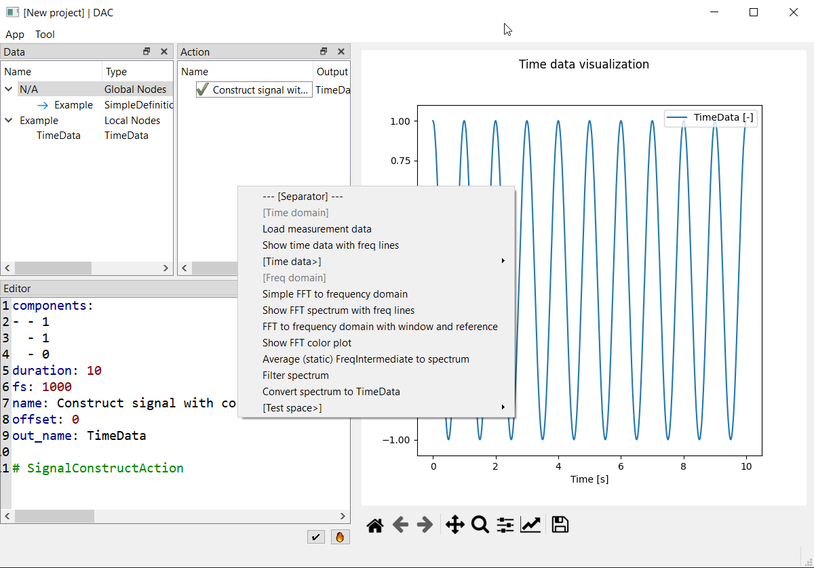

# Data Action Context

DAC provides a minimal frame for (measurement) data analysis
if you want to:

- Visualize data, process and interact
- Customize your analysis
- Save the analysis and load back
- Enable multiple analysis of same processing (like batch analysis)
- Link different analysis

Example of DAC user interface as shown below:

## Concepts

### Data Action

The processing is essentially "function call to data (objects or parameters)".

The actions to data can be processing (non-interactive and time consuming, with outputs) or visualing (interactive, no output).

### Interaction

Predefined click-able Jupyter notebook

### Context

For multiple measurements / analyses under different conditions, the processing can be very similar, with a few parameters changed.

To enable same processing and share "variable names" among different conditions. Context is used.

### Auxiliaries

**Quick tasks (on action node)**

**Quick actions (on data node)**

## Get started

## Modules

Besides the minimal frame, this repo also provides usable modules for common measurement data analyis.

## Extending

### `data.py` and `actions.py`

(scripting: use the classes directly)

### `plugins.yaml`
