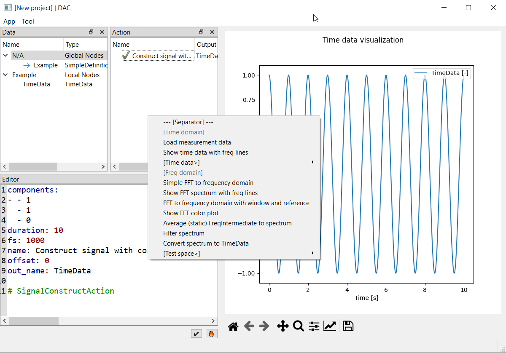

# Data Action Context (DAC)

DAC is a minimal framework for (measurement) data analysis, if you want to:

- Visualize data, process and interact
- Customize your analysis
- Save the analysis and load back
- Run the same analysis under multiple conditions
- Link different analyses together

The analysis is expressed as a sequence of **actions** applied to **data**,
wired together through a shared **context** and persisted as a plain JSON
project file.

Example of the DAC user interface:



## Installation

DAC requires **Python >= 3.12** and is published on PyPI as `miz-dac`.

```bash
# Core only (headless)
pip install miz-dac

# With the PyQt6 desktop GUI
pip install "miz-dac[gui]"

# With the embedded IPython / Jupyter console
pip install "miz-dac[ipy]"

# With the DAC Web remote bridge (pywebview)
pip install "miz-dac[remote]"
```

## Get started

Launch the desktop GUI:

```bash
# via the installed console script
dac-bin

# or directly
python -m dac.gui
```

The `dac-bin` entry point supports a few options:

```bash
dac-bin --project-file analysis.dac.json   # open an existing project
dac-bin --scenario-file my_scenario.yaml   # use a specific scenario
```

Scenario discovery is configurable through environment variables:

- `SCENARIO_DIR` — directory containing `*.yaml` scenario files
  (default: `dac/scenarios`)
- `SCENARIO_DEFAULT` — default scenario file (default: `0.base.yaml`)

## Concepts

### Data & Action

Processing is essentially "function calls applied to data (objects or
parameters)".

Actions applied to data can be:

- **Processing** — non-interactive, possibly time-consuming, producing outputs
- **Visualization** — interactive, no output

### Context

For multiple measurements / analyses under different conditions, the processing
is often very similar, with only a few parameters changed. **Context** allows
the same processing logic to share variable names across different conditions.

### Auxiliaries

**Quick tasks (on action nodes)** — assist parameter input. Sometimes a
parameter needs to interact with the output of a previous action, or is long to
type (e.g. a file path). Quick tasks fill parameters through interactions.

**Quick actions (on data nodes)** — for free exploration. A quick action creates
an action *virtually* (not added to the project) and runs it on selected data
nodes with default parameters. When fine parameter tuning is required, create a
normal action instead.

## Modules

Besides the minimal framework, the repo ships usable modules for common
measurement data analysis. Each module defines data types and the
processing / visualization actions for a topic.

| Module | Contents |
| ------ | -------- |
| `dac.modules.timedata` | `TimeData` for high-sample-rate time series; filter, resample, envelope, truncate, integrate, differentiate, statistics |
| `dac.modules.nvh` | Frequency-domain data (`FreqDomainData`, `OrderSlice`), FFT / STFT, spectrum visualization, octave / envelope / cepstrum / coherence; window & averaging enums |
| `dac.modules.drivetrain` | `GearboxDefinition`, `GearStage`, `BallBearing` — gear/bearing defect and order frequencies, order-line marking |
| `dac.modules.pch` | `TimeChannel` / `TimeSegment` / `TSChannel` / `TSSegment` — acquisition channels with lazy loading and absolute timestamps |
| `dac.modules.event_log` | `EventLogCollection` / `EventLogEntry` / `EventStatistics` — annotate time-series with labeled event ranges and extract statistics |

## Scenarios & projects

### Scenario (YAML)

A scenario defines which data types and actions are available, and how they are
laid out in the UI. It is described by a YAML file (see
`dac/scenarios/0.base.yaml` for a full example):

```yaml
inherit: null              # optional: relative path to a base YAML to inherit

alias:                     # shortcuts for module paths, e.g. /dd/ -> dac.core.data
  dd: dac.core.data
  da: dac.core.actions
  mt: dac.modules.timedata

data:
  _:                       # data types available as global context keys
  - /dd/SimpleDefinition

actions:
  _:                       # actions for the global context
  - /da/Separator
  /dd/SimpleDefinition:    # actions available under a specific context type
  - /mt/actions.LoadAction
  - /mt/actions.ShowTimeDataAction

quick_actions:             # right-click actions on data nodes
  /mt/TimeData:
  - [/mt/actions.ShowTimeDataAction, channels, {}]

quick_tasks:               # task helpers for action parameter input
  /mt/actions.LoadAction:
  - [/mt/tasks.FillFpathsTask, "Select measurement files"]

default_task:              # auto-invoked task when an action is created
  /mt/actions.LoadAction: [/mt/tasks.FillFpathsTask, "Select measurement files"]

drop_actions:              # actions triggered by drag-and-drop of files
  ".tdms":
  - [/mt/actions.LoadAction, fpaths, {}]
```

### Project (JSON)

The state of a project — context keys, data nodes, and configured actions — is
saved to a `*.dac.json` file and can be loaded back:

```json
{
  "dac": {
    "_": { "version": "0.7.0" },
    "exec": "...",
    "contexts": [{ "_uuid_": "...", "_class_": "dac.core.data.SimpleDefinition", "name": "..." }],
    "actions": [{ "_uuid_": "...", "_class_": "...", "_context_": "...", "name": "...", "param1": "..." }]
  }
}
```

## Extending

DAC is meant to be extended with your own data types and actions.

### Data types (`data.py`)

Subclass `DataBase` (from `dac.core.data`). Public attributes of basic types
(`int`, `float`, `str`, `bool`, and nested `list` / `dict`) are automatically
serialized; prefix private attributes with `_` to keep them out of the saved
configuration.

### Actions (`actions.py`)

Subclass one of the action base classes from `dac.core.actions`:

- `ActionBase` — basic, no threading
- `ProcessActionBase` (`PAB`) — CPU work, runs in a worker thread
- `VisualizeActionBase` (`VAB`) — Matplotlib figure interaction
- `TableActionBase` (`TAB`) — table rendering
- `SequenceActionBase` (`SAB`) — runs sub-actions in sequence

An action implements `__call__`, whose signature provides parameter hints
(type annotations become input hints, defaults become initial configuration).
Return a `DataNode` (or a list of them) to add results to the current context.

```python
class ScaleTimeDataAction(PAB):
    CAPTION = "Scale time data"
    def __call__(self, channel: TimeData, factor: float = 1.0) -> TimeData:
        return TimeData(y=channel.y * factor, dt=channel.dt)
```

### Wiring it up

Register the new types through `Container` and expose them in a scenario YAML:

- `Container.RegisterGlobalDataType(...)` / `RegisterContextAction(...)` — or simply list them in the scenario YAML.
- Name-based lookup resolves `DataNode` parameters by name in the current,
  global, and context-key contexts; `Enum` members by name; and collections
  recursively. Custom types can be resolved via `RegisterNodeTypeAgency`.

### Script usage

The GUI, scenarios and contexts are all optional. `DataNode` and `ActionNode`
are plain classes, so you can create them directly, pass parameters, and apply
an action to your data — no `Container` or scenario needed:

```python
import numpy as np
from dac.modules.timedata import TimeData
from dac.modules.timedata.actions import FilterAction

# 1. Create a data node directly
data = TimeData(name="accel", y=np.sin(2 * np.pi * 30 * np.arange(1000) / 1000), dt=0.001)

# 2. Data nodes also carry processing methods you can call straight away
rms = data.effective_value()
integrated = data.integrate()
diff = data.differentiate()

# 3. Apply an action to the data with explicit parameters
filtered = FilterAction(context_key=None)(
    channels=[data], freqs=[10.0, 100.0], order=3
)  # -> list[TimeData]
```

Or define your own action and call it like a function:

```python
from dac.core.actions import PAB
from dac.modules.timedata import TimeData

class ScaleTimeDataAction(PAB):
    CAPTION = "Scale time data"
    def __call__(self, channel: TimeData, factor: float = 1.0) -> TimeData:
        return TimeData(y=channel.y * factor, dt=channel.dt, y_unit=channel.y_unit)

scaled = ScaleTimeDataAction(context_key=None)(channel=data, factor=2.0)
```

## Appendix

### OOP or function calls

Data and actions are modeled as classes (`DataNode` / `ActionNode`), but using
them feels like function calls: an action is invoked via `__call__`, with
parameters resolved by name from the current context. This keeps analyses
composable, introspectable, and serializable.
